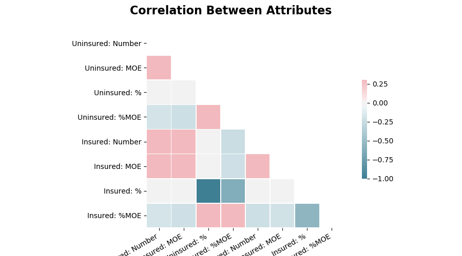
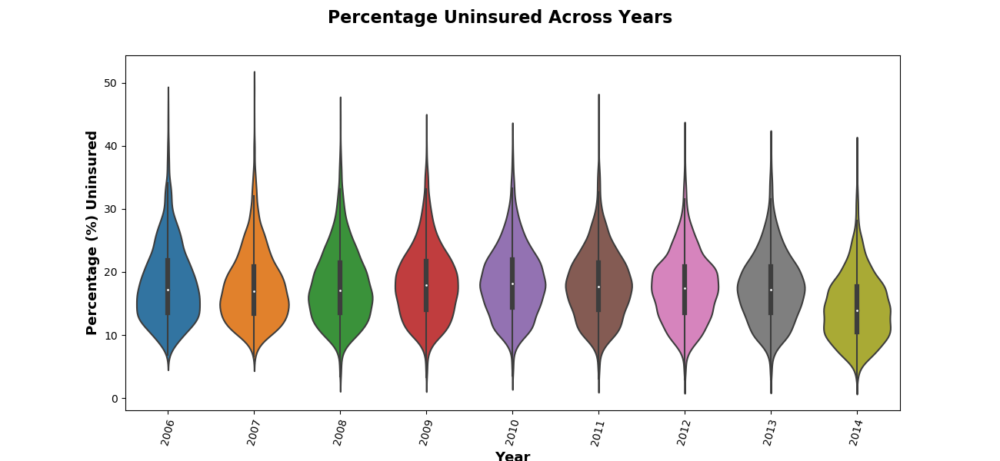
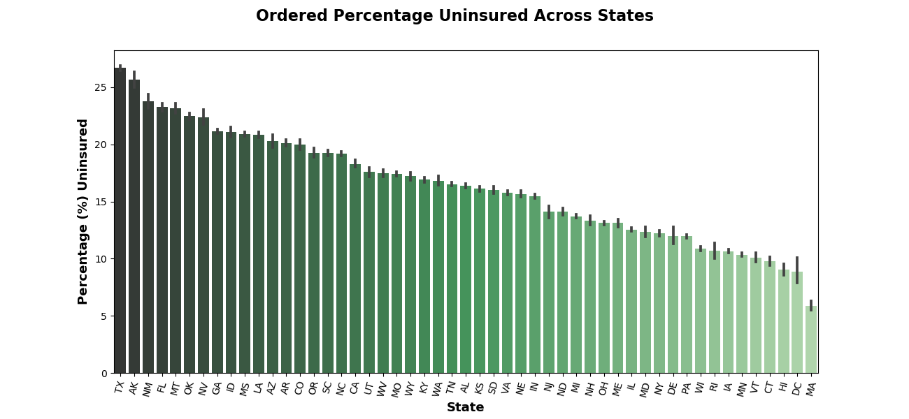
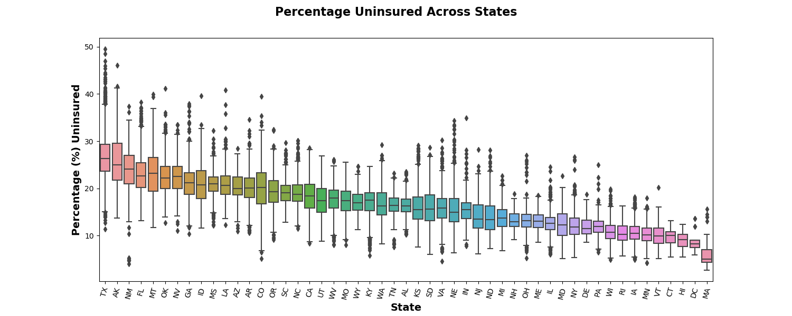

# Medicare Spending Across the United States

### Overview

[data](https://github.com/brendan-drew/County-Medicare-Spending/tree/master/data)

### Guiding Questions/Goals

1. Is there a statistically significant difference in the percentage of uninsured individuals across states?

2. Has there been a statistically significant change in the percentage of uninsured from year to year (2006 - 2014)?

3. Predict total spending on medical expenses (aggregated across states)


### Hypothesis Tests

Although, I will be predicting on a different data set, before setting out to answer my two inferential questions, I decided to view a correlation matrix to get a sense of how my data behaved. The only thing to note is that, as expected, the percent uninsured and the percent insured are perfectly negatively correlated.



Moving forward, for both hypothesis tests, my signficance level will be 0.05.

#### Question

Has there been a statistically significant change in the percentage of uninsured individuals from year to year (2006 - 2014)?

* *Null Hypothesis: There is no significant difference between the average percentage of uninsured individuals from year to year*

* *Alternative Hypothesis: At least one of the years have a different average percent of uninsured individuals than the other years*

##### Visual Exploration



##### Statistical Exploration

Although visually it seems unnecessary to prove this statistically, when I *did* perform ANOVA on this data, the result was rather shocking.

Calculated in Python using `scipy.stats.f_oneway`, by passing the arrays of the Uninsure: % for each year, an F-Statistic of **153** is returned, with a corresponding P-Value far below my level of signficance.

With a little disbelief, I turned to R to confirm these findings, reproduced below.

```
year_anova <- aov(percent_uninsured ~ year, data = df)
summary(year_anova)

               Df | Sum Sq | Mean Sq | F value | Pr(>F)    
year            8   38660     4833      153.2    <2e-16 ***
Residuals   28722   906120     32                   
---
Signif. codes:  0 ‘***’ 0.001 ‘**’ 0.01 ‘*’ 0.05 ‘.’ 0.1 ‘ ’ 1
```

To be conservative, I decided to use an effect size of 0.05 (*half* that recommended by Cohen for small effect sizes) and calculate the power of my test in R as well, the result of which is reproduced below.

```
Balanced one-way analysis of variance power calculation

              k = 9
              n = 3192
              f = 0.05
      sig.level = 0.05
          power = 0.9999999
```

Looking further at *which* years have a significant difference, we get the following.

```
2014-2006       0.000000e+00  
2014-2007       0.000000e+00  
2014-2008       0.000000e+00  
2014-2009       0.000000e+00  
2014-2010       0.000000e+00  
2014-2011       0.000000e+00  
2014-2012       0.000000e+00  
2014-2013       0.000000e+00  
2013-2010       3.320018e-10  
2012-2010       5.573403e-10  
2010-2007       6.386250e-07  
2013-2009       3.482696e-05  
2012-2009       5.065515e-05  
2013-2006       8.212339e-05  
2012-2006       1.178423e-04  
2010-2008       3.270694e-04  
2011-2010       5.093999e-03  
2009-2007       6.502273e-03  
2007-2006       1.220040e-02 
```

When the theory doesn't fit the data, *we let the theory go*, therefore rejecting out null hypothesis and accepting the alternative.

#### Question

Is there a statistically significant difference in the percentage of uninsured individuals across states?

* *Null Hypothesis: There is no significant difference between the means of the percentage of the population uninsured across states (Washington, D.C as separate state).*

* *Alternative Hypothesis: At least one of the states have a higher mean percent uninsured than the other states*

##### Visual Exploration





##### Statistical Exploration

With an F-Statistic of `1013` and a corresponding P-value well below our significance level, we can reject the null hypothesis and accept that there truly is a difference in the percent of uninsured individuals across states.

```
state_anova <- aov(percent_uninsured ~ state, data=df)
summary(state_anova)

               Df | Sum Sq |  Mean Sq | F value | Pr(>F)    
state          50   603282    12066      1013    <2e-16 ***
Residuals   28680   341498     12                   
---
Signif. codes:  0 ‘***’ 0.001 ‘**’ 0.01 ‘*’ 0.05 ‘.’ 0.1 ‘ ’ 1
```
