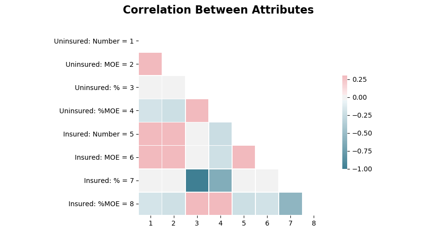

# Medicare Spending Across the United States

### Overview

[data](https://github.com/brendan-drew/County-Medicare-Spending/tree/master/data)

### Guiding Questions/Goals

1. Is there a statistically significant difference in the percentage of uninsured individuals across states?

2. Has there been a statistically significant change in the percentage of uninsured from year to year (2006 - 2014)?

3. Predict total spending on medical expenses (aggregated across states)


### Hypothesis Tests

For both hypothesis tests, my signficance level will be 0.05

#### Question

Has there been a statistically significant change in the percentage of uninsured individuals from year to year (2006 - 2014)?

* *Null Hypothesis: There is no significant difference between the average percentage of uninsured individuals from year to year*

* *Alternative Hypothesis: At least one of the years have a different average percent of uninsured individuals than the other years* 

##### Visual Exploration


#### Question

Is there a statistically significant difference in the percentage of uninsured individuals across states?

* *Null Hypothesis: There is no significant difference between the means of the percentage of the population uninsured across states (Washington, D.C as separate state).*

* *Alternative Hypothesis: At least one of the states have a higher mean percent uninsured than the other states*

##### Visual Exploration


##### Statistical Exploration

With an F-Statistic of `1013` and a P-value well below our

```
state_anova <- aov(percent_uninsured ~ state, data=df)
summary(state_anova)

               Df | Sum Sq |  Mean Sq | F value | Pr(>F)    
state          50   603282    12066      1013    <2e-16 ***
Residuals   28680   341498     12                   
---
Signif. codes:  0 ‘***’ 0.001 ‘**’ 0.01 ‘*’ 0.05 ‘.’ 0.1 ‘ ’ 1
```



